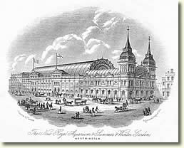
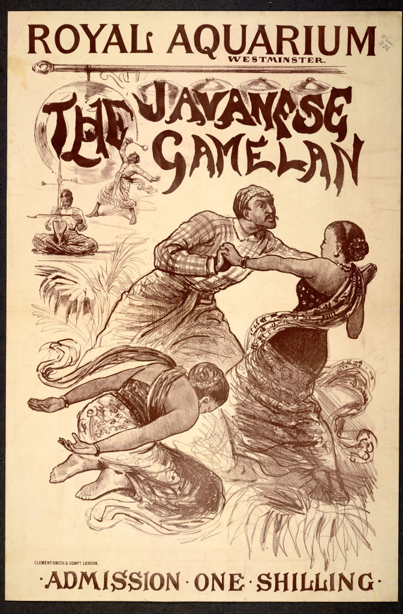
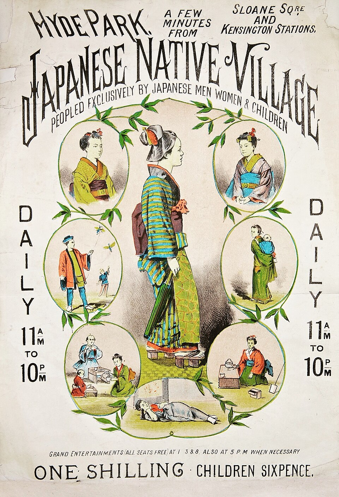

The late 19th century was a time when colonialism started to bring the music of far way lands to Europe, thus giving the public  opportunities to experience non-western music first hand.  The most well-known example is Claude Debussy's encounter with Sundanese (i.e., Western Javanese) gamelan at the 1889 Exposition Universelle in Paris. The music impressed him so profoundly that he wrote (after many years) that "...Javanese music is based on a type of counterpoint by comparison with which that of Palestrina is child's play."  But that level of appreciation was far from common.  A London pundit who visited a gamelan performance in 1882, for example, compared the bronze instruments to saucepans and the music to "noise made by the kitchen utensils of a Margate steamer in a storm" [^1].  Witnessing "savages" making music that they could barely understand, European scholars started to ponder: what does all of this say about our music and culture?

In this article, I want to share the story of an encounter that would lead to the birth of a new scholarly discipline - musicology.  It will have an impact on our understanding of music and sounds no less profound than that on Debussy. 

## A gamelan in a faux aquarium

<figure style="float: left; margin: 0 1.5em 1em 0;">
  
</figure>

The [Royal Aquarium of Westminster](https://www.gsarchive.net/articles/sull_aquarium/index.html) opened in 1876  was perhaps one of the strangest spectacles that symbolised the decadence of fin de siècle London.  Housed in a grandiose building that took up an entire block, just a short walk from the Westminster Abbey and Houses of Parliament, the Aquarium was originally conceived to be grand venue for education, concerts and highbrow entertainment.  The great hall was designed to be surrounded by giant fish tanks for the visitors to enjoy the wonders of the ocean, but the ambitious plan didn't work out.  There were very few fish in the tanks in the self-styled aquarium, and there was a bizarre attempt to house a beluga whale in the tanks.  The marine mammal sadly didn't last long. 

The venue was in constant financial troubles, and just several years of operation, it gradually transitioned to something more like a carninval fairground, which regularly featured magic acts, stunts, animal shows, and competitions.  The Aquarium exhibited [Chang the Chinese Giant](https://en.wikipedia.org/wiki/Zhan_Shichai), among other human oddities for the amusement of Londoners.

<figure style="float: right; margin: 0 0 1em 1.5em;">
  
</figure>

The bizarre music and dancing from exotic lands was another form of popular attraction.  In 1879, the Dutch used a gamelan performance in Arnhem to thrill Europeans with the sights and sounds of Dutch East Indies. The popular exhibition became a template of "Javanese Village" shows to follow in other European cities.  In 1882, 14 musicians and four singers were brought in from Yogyakarta, central Java to the Royal Aquarium for 3 months. The public responses were mixed (to say the least). Some said that the singing of the female singer-dancers to be mere "screeching" and "groaning", and the gamelan music as "monotonous" and "apt to jar on ordinary English ears." [^1]

## The unexpected visitors with tuning forks

The gamelan at the Royal Aquarium put on 4 shows daily.  One day, in their off hours (most likely in the evening), a pair of visitors arrived at the Aquarium asking to speak to the Dutch supervisor.  The old gentleman, in perfect English announciation, asked if they could check out the gamelan instruments and measure them. The request must have completely confunded the Dutch man. "You want to do _what_ with the instruments?" cried the Dutch, staring worriedly at a mysterious wooden box that he was carrying.

The old gentleman was [Alexander Ellis](https://en.wikipedia.org/wiki/Alexander_John_Ellis), an English polymath who is best known as a pioneer of modern phonetics. His passion in the understanding and documentation of the pronunciation of the English language would later inspire Bernard Shaw in the creation of the Professor Higgins character in [Pygmalion](https://en.wikipedia.org/wiki/Pygmalion_(play))[^2]. Ellis was trained in mathematics and had translated Hermann von Helmholtz's groundbreaking work in the perception of sound and music, _On the Sensations of Tone_, from German to English.  This was a publication of uttermost importance in our subject, and I'll have a lot to say about it later in this article.

Ellis was accompanied by a younger man, one [Mr. Hipkins](https://en.wikipedia.org/wiki/Alfred_James_Hipkins), who was sort of a man with an unusual superpower: a pair of legendarily sensitive ears.  He was an expert on piano tuning and was a music scholar. 

Confusion ensued due to the language barrier among the Javanese, the Dutch and the English, but eventually Ellis was able to explain that he wanted to measure the frequency of the individual sound that the gamelan instruments made, using the 100 precisely calibrated tuning forks[^3] that he brought in the wooden box.  For the next several hours, the Javanese watched, amused or confused, Mr. Hipkins listening intensely to the vibrations of the tuning forks as one of them hit the bronze keys with a mallet.  Every time Mr. Hipkins nodded his head, Ellis excitedly wrote numbers down in a big notebook. 

It's one of the weirdest experiments of 19th-century science. Two English gentlemen listening to the strange and unfamiliar sounds of Javanese gamelan, late at night, in a giant "aquarium" at the heart of London.  It's a major part of Alexander Ellis's multi-year project to systematically measure the sounds of instruments from all over the world, which would lead to something new - the beginning of quantitative research in musicology.  This data collection exercise was enabled by Ellis's invention of a new unit of measurment called [cent](https://en.wikipedia.org/wiki/Cent_(music)), which allowed scholars to faithfully record the pitch of non-western music without the constraints imposed by the Western music notation.  It is a new scientific language that allowed scientists to talk and think about non-western music.

## "Field work" at the capital of the British Empire

Exhibitions of people from exotic parts of the world were sensational events in 19th century Europe, which regularly attracted millions of visitors. The [1884 International Health Exhibition](https://en.wikipedia.org/wiki/International_Health_Exhibition) in London featured a large-scale "Chinese Court" with a full scale restaurant a tea house, a pavilion, and a Chinese garden.  Six Chinese musicians mingled with the crowd and regaled them with "traditional Chinese music"[^4].  The Chinese musicians' rendition of _God Saves the Queen_ with Chinese instruments won enthusiastic applause. 

Of course, Ellis and Hapkins wouldn't miss the opportunity to observe Chinese musicians in action.  For 4 days, they talked to the musicians with the help of interpreters and repeated the measurements with tuning forks.

<figure style="float: right; margin: 0 0 1em 1.5em;">
  
</figure>

In 1887, the exotic beauty of Japanese culture was in rage in London.  Again, Ellis brought his tuning forks to the large-scale [Japanese Village](https://en.wikipedia.org/wiki/Japanese_Village,_Knightsbridge) constructed in Knightsbridge.

Hundreds years of imperialism had made it possible for Ellis to assemble the first data set of musical scales from a number of different cultures, while staying in London.  He invited a sitar player and a highland bag pipe player to his house for his measurements; he consulted scholarly publications, exchanged letters with experts overseas, and went to museums in London to examine exotic instruments.  

His grab-bag approach was problematic from today's point of view, but it was before ethnomusicology was established as a field of scholatship.

## The capriciousness of musical sounds from around the world

> "The Musical Scale is not one, not 'natural', nor even founded 
> necessarily on the laws of the constitution of musical sound, 
> so beautifully worked out by Helmholtz, but very diverse, very 
> artificial, and very capricious."
>
> — Alexander J. Ellis, *On the Musical Scales of Various Nations*, 
> Journal of the Society of Arts, March 27, 1885, p. 526

von Hornbostel (1922:3) declared Ellis the "true founder of comparative
scientific musicology," a

## Helmholtz

## Inharmony

## Sources

- About the Royal Aquarium, see the [article](https://www.gsarchive.net/articles/sull_aquarium/index.html) by John Sands. Also, _Performing Otherness: Java and Bali on International Stages, 1905-1952_ by Matthew Isaac Cohen (2010).

- The Japanese Village poster: from Wikipedia

[^1]: _Performing Otherness: Java and Bali on International Stages, 1905-1952_ by Matthew Isaac Cohen (2010).

[^2]: No, Ellis didn't make people repeat the line "The rain in Spain stays mainly in the plain" endlessly, as Professor Higgins did in the musical adaptation of Shaw's play, because the prickly personality of the professor was based on another phonetician, Henry Sweet.

[^3]: Alexander Ellis's tuning forks are still preserved in a museum. You can view them [here](https://collection.sciencemuseumgroup.org.uk/objects/co5980/elliss-tuning-fork-tonometer).

[^4]: Unknown to Ellis, the performers in the 1884 Health Exhibition were not the kind of classical Chinese musicians that he had assumed. The performers were in fact [Mancus](https://en.wikipedia.org/wiki/Manchu_people) from the capital of the Chinese empire.  The music that they performed was Manchurian and even Mongolian, rather than classical Chinese. See [this article](https://www.researchbank.ac.nz/server/api/core/bitstreams/6cb76be1-4b1b-492b-829e-b2ed4f2f7f64/content).
